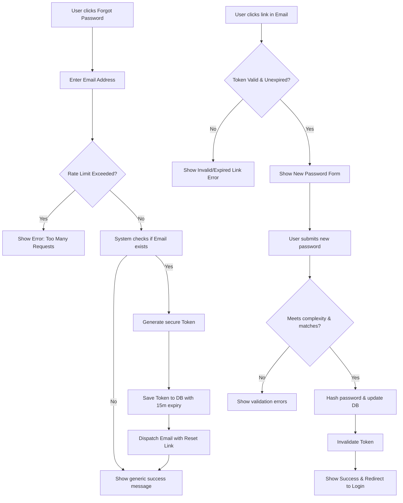

# User Password Reset System
**ID**: PR-001
**Version**: 1.0
**Status**: Draft
**Type**: Functional Specification

## Overview & Purpose
The User Password Reset System provides a secure, self-service mechanism for registered users to regain access to their accounts when they have forgotten their passwords. By verifying ownership of the registered email address via a time-bound, single-use cryptographic token, the system ensures that only authorized users can modify their credentials.

## Goals
*   Enable users to securely reset their passwords without human intervention.
*   Reduce customer support ticket volume related to login issues by at least 80%.
*   Ensure the password recovery process complies with OWASP authentication and session management guidelines (e.g., preventing email enumeration).

## Target Users
*   **Registered End Users**: Individuals who have an existing account but cannot remember their password.

## Stakeholders
*   **Product Manager**: Owns the feature roadmap and success metrics.
*   **Security Team**: Ensures the token generation and password hashing meet security standards.
*   **Customer Support Lead**: Monitors the reduction in manual password reset requests.

## Scope (In / Out)
**In Scope:**
*   "Forgot Password" request form (email input).
*   Generation and storage of secure, single-use, time-bound reset tokens.
*   Dispatching automated emails containing the reset link.
*   "Set New Password" form with complexity validation.
*   Updating the user's password hash in the database.

**Out of Scope:**
*   SMS-based or biometric password recovery.
*   Administrator-forced password resets (handled in a separate admin portal spec).
*   Magic link authentication (passwordless login).

**MoSCoW Prioritization:**
*   **Must Have**: Email input form, secure token generation, email delivery, password update form, token expiration (15 minutes).
*   **Should Have**: Rate limiting on reset requests to prevent spam/abuse.
*   **Could Have**: Notification email sent to the user after a successful password change.
*   **Won't Have**: SMS recovery, secondary email recovery.

## Functional Requirements
*   **FR1: Request Reset**: The system must allow a user to submit an email address to request a password reset link.
*   **FR2: Token Generation**: Upon receiving a valid request for an existing user, the system must generate a cryptographically secure, single-use token that expires in 15 minutes.
*   **FR3: Email Dispatch**: The system must send an email containing a URL with the embedded token to the user's registered email address.
*   **FR4: Anti-Enumeration**: The system must display the exact same success message regardless of whether the submitted email exists in the database.
*   **FR5: Token Validation**: The system must validate the token's existence, association with the user, and expiration status when the reset link is clicked.
*   **FR6: Password Update**: The system must allow the user to input and confirm a new password, validate it against complexity rules, hash it, and update the user record.
*   **FR7: Token Invalidation**: The system must immediately invalidate the reset token upon successful password update.

## User Stories
*   **US1**: As a registered user, I want to request a password reset link via my email so that I can regain access to my account if I forget my password.
    *   *Given* I am on the login screen, *When* I click "Forgot Password", *Then* I am navigated to the password reset request form.
    *   *Given* I submit my email address, *When* the system processes the request, *Then* I see a generic success message instructing me to check my email.
*   **US2**: As a registered user, I want to click a secure link in my email to set a new password so that my account remains protected.
    *   *Given* I receive the reset email, *When* I click the link within 15 minutes, *Then* I am presented with a form to enter a new password.
    *   *Given* I enter a valid new password and matching confirmation, *When* I submit the form, *Then* my password is changed, the token is consumed, and I am redirected to the login screen with a success message.

## Inputs/Outputs/Data Flow
**Inputs:**
*   Email Address (String, standard email format).
*   Reset Token (Alphanumeric string, passed via URL parameter).
*   New Password (String, secure text).
*   Password Confirmation (String, secure text).

**Outputs:**
*   Password Reset Email (HTML/Text template containing the reset URL).
*   Success/Error UI notifications.

**Data Entities / Models Touched:**
*   `User`: Read (to verify email existence), Update (to save the new password hash).
*   `PasswordResetToken`: Create (when requested), Read (when link clicked), Update/Delete (when consumed or expired).

## Flows

## Edge Cases & Error States
*   **Email Not Found**: If the user submits an email not in the system, the system fails silently on the backend and shows the standard success message to prevent malicious actors from enumerating valid accounts.
*   **Token Expired**: If the user clicks the link after 15 minutes, the system displays an "Expired Link" error and provides a button to request a new reset link.
*   **Token Already Used**: If the user clicks a link that has already resulted in a successful password change, the system displays an "Invalid Link" error.
*   **Passwords Do Not Match**: If the "New Password" and "Confirm Password" fields differ, the UI displays an inline validation error and prevents submission.
*   **Weak Password**: If the new password fails complexity requirements (e.g., length, character types), the UI displays specific inline errors detailing the missing criteria.
*   **Rate Limiting**: If a user/IP requests more than 3 password resets within 10 minutes, the system blocks the request and returns an HTTP 429 error state.

## Acceptance Criteria
*   **AC1 (Request & Anti-Enumeration)**: 
    *   *Given* a user submits the forgot password form, *When* the email exists OR does not exist in the database, *Then* the exact same UI success message ("If an account exists, an email has been sent") is displayed.
*   **AC2 (Token Generation & Delivery)**: 
    *   *Given* a valid email is submitted, *When* the system processes the request, *Then* a 64-character CSPRNG token is saved to the database with a 15-minute expiration, and an email is dispatched to the user containing the token in the URL.
*   **AC3 (Token Validation - Happy Path)**: 
    *   *Given* a user navigates to the reset URL with a valid, unexpired token, *When* the page loads, *Then* the new password input form is displayed.
*   **AC4 (Token Validation - Failure)**: 
    *   *Given* a user navigates to the reset URL with an invalid or expired token, *When* the page loads, *Then* an error message is displayed and the password input form is hidden.
*   **AC5 (Password Update)**: 
    *   *Given* a user is on the new password form, *When* they submit a valid password that matches the confirmation field, *Then* their password hash is updated in the database, the token is marked as consumed, and they are redirected to the login page.
*   **AC6 (Rate Limiting)**: 
    *   *Given* an IP address has requested 3 password resets in the last 10 minutes, *When* they attempt a 4th request, *Then* the system rejects the request and displays a "Too many requests, please try again later" error.

## Non-Functional Requirements
*   **Security**: Tokens must be generated using a Cryptographically Secure Pseudorandom Number Generator (CSPRNG). Passwords must be hashed using Argon2id or bcrypt with a work factor of at least 12.
*   **Performance**: The initial password reset request must respond to the client within 500ms. The email must be handed off to the SMTP provider within 2 seconds.
*   **Usability**: All forms must be fully navigable via keyboard and meet WCAG 2.1 AA accessibility standards.
*   **Reliability**: The email dispatch mechanism must have a retry queue in case the external SMTP provider is temporarily unavailable.

## Assumptions
*   An external email delivery service (e.g., SendGrid, AWS SES, Mailgun) is already configured, integrated, and available for use by the application.
*   The application utilizes a centralized relational database for user management.
*   Frontend routing is capable of capturing URL parameters (the token) and passing them to the backend API.

## Dependencies
*   **Email Provider API**: Required for dispatching the reset emails.
*   **Frontend Application**: Required to host the `/forgot-password` and `/reset-password?token=...` routes.

## Open Questions
*   What are the exact password complexity rules that need to be enforced on the new password form (e.g., minimum length, required special characters)?
*   Do we need to instantly terminate all active user sessions (force logout on all devices) once a password is successfully reset?

## Success Metrics
*   **Delivery Rate**: > 99% of password reset emails successfully delivered to the user's inbox (measured via SMTP provider logs).
*   **Support Reduction**: A 80% reduction in customer support tickets categorized under "Cannot login / Forgot Password" within 30 days of launch.
*   **Completion Rate**: > 75% of generated password reset tokens are successfully consumed within their 15-minute validity window.